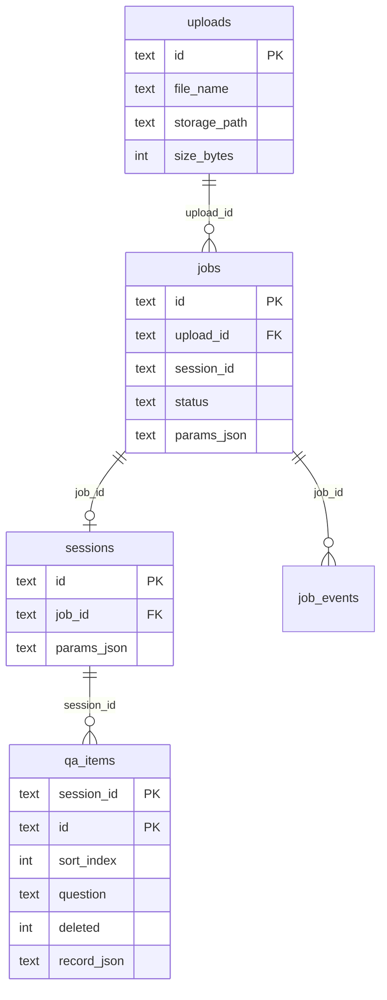

# DataLight QA 工作台 — SQLite 数据库设计

> 服务端 HTTP 层（`src/server/`）持久化设计。与 `ui/BACKEND_API.md` 及当前 `DataStore` API 对齐。  
> 库文件默认路径：`{DATALIGHT_SERVER_DATA}/datalight.db`

---

## 1. 分层原则

```text
SQLite（元数据 + 工作台编辑态）
    ├── uploads / jobs / sessions / qa_items
    ├── job_events（阶段日志）
    ├── settings_overrides（运行时配置覆盖，可选）
    └── qa_items_fts（全文搜索，Phase 3）

文件系统（大对象 + 流水线产物）
    ├── uploads/{uploadId}/doc.md
    └── jobs/{jobId}/output/…   chunks.jsonl、qa_scored.jsonl 等
```

| 数据 | 入库 | 说明 |
|------|------|------|
| 上传 `.md` 正文 | 否 | 体积大，流水线直接读路径 |
| Upload 元数据 | 是 | 关联 Job、校验 |
| Job 状态与参数 | 是 | 列表、筛选、轮询 |
| 流水线 JSONL 产物 | 否 | DB 仅存 `result_paths_json` |
| Session 元数据 | 是 | 关联 Job、恢复工作台 |
| QA 行（编辑态） | 是 | 单条 PATCH / expand / evaluate |
| LLM 密钥 | 否 | `configs/datalight.yaml` / 环境变量 |
| Taxonomy 全量 | 否（首版） | 来自 YAML |

---

## 2. ER 关系



---

## 3. 表结构

### 3.1 `uploads`

```sql
CREATE TABLE uploads (
    id            TEXT PRIMARY KEY,
    file_name     TEXT NOT NULL,
    storage_path  TEXT NOT NULL,
    size_bytes    INTEGER NOT NULL,
    sha256        TEXT,
    created_at    TEXT NOT NULL
);
```

### 3.2 `jobs`

```sql
CREATE TABLE jobs (
    id                TEXT PRIMARY KEY,
    upload_id         TEXT NOT NULL REFERENCES uploads(id),
    session_id        TEXT,
    source_file_name  TEXT NOT NULL,
    pipeline          TEXT NOT NULL,
    generator         TEXT,
    status            TEXT NOT NULL,
    stage             TEXT,
    params_json       TEXT NOT NULL,
    qa_count          INTEGER,
    error_message     TEXT,
    result_paths_json TEXT,
    idempotency_key   TEXT UNIQUE,
    created_at        TEXT NOT NULL,
    finished_at       TEXT,
    updated_at        TEXT NOT NULL
);
```

### 3.3 `sessions`

```sql
CREATE TABLE sessions (
    id               TEXT PRIMARY KEY,
    job_id           TEXT NOT NULL UNIQUE REFERENCES jobs(id) ON DELETE CASCADE,
    source_file_name TEXT NOT NULL,
    pipeline         TEXT NOT NULL,
    generator        TEXT,
    params_json      TEXT NOT NULL,
    created_at       TEXT NOT NULL,
    updated_at       TEXT NOT NULL
);
```

### 3.4 `qa_items`

热字段列化 + `record_json` 溢出，支持列表筛选与字段演进。

```sql
CREATE TABLE qa_items (
    id            TEXT NOT NULL,
    session_id    TEXT NOT NULL REFERENCES sessions(id) ON DELETE CASCADE,
    sort_index    INTEGER NOT NULL,
    question      TEXT,
    answer        TEXT,
    chunk_text    TEXT,
    expanded_question TEXT,
    expanded_answer   TEXT,
    hop_type      TEXT,
    level1_name   TEXT,
    level2_name   TEXT,
    task_type     TEXT,
    question_quality_grade       REAL,
    answer_alignment_grade       REAL,
    answer_verifiability_grade   REAL,
    downstream_value_grade       REAL,
    deleted       INTEGER NOT NULL DEFAULT 0,
    dirty         INTEGER NOT NULL DEFAULT 0,
    selected      INTEGER NOT NULL DEFAULT 0,
    filter_passed INTEGER,
    user_modified INTEGER NOT NULL DEFAULT 0,
    record_json   TEXT NOT NULL,
    created_at    TEXT NOT NULL,
    updated_at    TEXT NOT NULL,
    PRIMARY KEY (session_id, id)
);
```

### 3.5 `job_events`（Phase 3）

```sql
CREATE TABLE job_events (
    id         INTEGER PRIMARY KEY AUTOINCREMENT,
    job_id     TEXT NOT NULL REFERENCES jobs(id) ON DELETE CASCADE,
    stage      TEXT,
    message    TEXT,
    created_at TEXT NOT NULL
);
```

### 3.6 `settings_overrides`（Phase 3）

```sql
CREATE TABLE settings_overrides (
    key         TEXT PRIMARY KEY,
    value_json  TEXT NOT NULL,
    updated_at  TEXT NOT NULL
);
```

### 3.7 `qa_items_fts`（Phase 3）

```sql
CREATE VIRTUAL TABLE qa_items_fts USING fts5(
    session_id UNINDEXED,
    item_id UNINDEXED,
    question,
    answer,
    expanded_question,
    tokenize='unicode61'
);
```

FTS5 虚拟表 `qa_items_fts` 已创建，全文搜索同步留待后续迭代（可批量 `rebuild_fts(session_id)`）。

---

## 4. API 映射

| API | 表 |
|-----|-----|
| `POST /uploads` | `uploads` + 文件 |
| `POST /jobs/qa` | `jobs` |
| `GET /jobs` | `jobs` |
| `GET /jobs/{id}/qa` | `qa_items`（或 JSONL 导入后写入） |
| `PUT /sessions/{id}` | `sessions` + `qa_items` |
| PATCH / expand / evaluate / DELETE qa | `qa_items` |
| `GET .../export` | `qa_items` |
| `DELETE /jobs/{id}` | `jobs` CASCADE |

---

## 5. 实施顺序

| 阶段 | 内容 | 迁移版本 |
|------|------|----------|
| Phase 1 | `uploads`、`jobs` | `001` |
| Phase 2 | `sessions`、`qa_items` | `002` |
| Phase 3 | `job_events`、`settings_overrides`、`qa_items_fts` | `003` |

实现位置：`src/server/db/`（`connection.py`、`migrations.py`、`legacy_import.py`、`qa_mapping.py`）。

启动时：

1. `PRAGMA journal_mode=WAL`、`foreign_keys=ON`
2. 顺序执行未应用的 migration
3. 若存在旧版 JSON 索引（`jobs/*/meta.json`、`sessions/*.json`），一次性导入 SQLite

---

## 6. SQLite 实践

```sql
PRAGMA journal_mode = WAL;
PRAGMA foreign_keys = ON;
PRAGMA synchronous = NORMAL;
```

- Job 后台线程与 API 共用连接池需注意：每线程独立 `sqlite3.connect`，WAL 模式下可并发读。
- 单条 QA 更新使用行级 `UPDATE`，避免整 Session JSON 重写。

---

## 7. 相关文档

| 文档 | 说明 |
|------|------|
| [ui/BACKEND_API.md](../ui/BACKEND_API.md) | HTTP 契约 |
| [src/server/README.md](../src/server/README.md) | 服务启动与环境变量 |
| [技术实现方案.md](./技术实现方案.md) | 流水线产物路径 |

---

*文档版本：与 `src/server/db/migrations.py` 及 `DataStore` SQLite 实现对齐（2026-06）*
