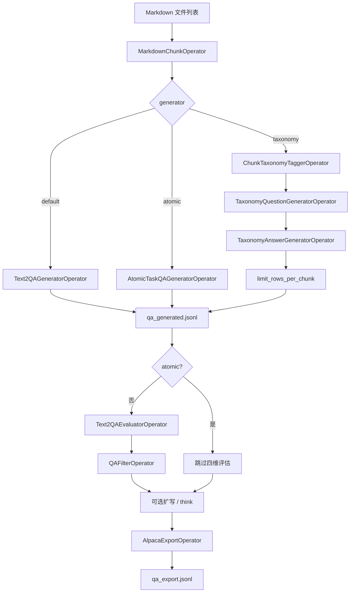

# DataLight 技术实现方案

> 本文档完全基于 `src/datalight/` 当前代码编写，描述 DataLight 包的架构、流水线与数据约定。  
> 版本：`datalight.__version__`（见 `src/datalight/version.py`）。

## 1. 背景与目标

DataLight 是独立的文档 → Markdown → QA → 训练样本 数据处理库，当前实现聚焦两条主线：

1. **文档摄取**：通过本地 MinerU 将 PDF、图片或 PDF URL 转为 Markdown，产出 `ingest_manifest.jsonl`。
2. **QA 数据生成**：基于 Markdown 切块、生成问答对，经评估/过滤、可选扩写与 think 增强，导出 Alpaca 风格 JSONL。

设计原则：

- 不依赖原 DataFlow 运行时；`thirdparty/dataflow/` 仅作参考，不参与 import。
- 模块相对独立，流程可组合；中间产物一律 JSONL，便于调试与断点续跑。
- 采用轻量 **Operator / Pipeline** 抽象，无 DAG 编译、无外部编排框架。
- 默认中文 QA；`target_language` 支持 `zh` / `en` / `auto`。
- 扩写、think、Agentic depth/width 为可选后处理，不强制编入主链路。

**入口方式**：通过 `DatalightService` 或 `datalight.service` 模块级函数编程调用；**当前包内无 Typer CLI**（`pyproject.toml` 未注册 console script）。

---

## 2. 包结构与模块职责

```text
src/datalight/
├── __init__.py              # 仅导出 __version__
├── config.py                # YAML 配置与 taxonomy 解析
├── llm.py                   # LLMClient 协议与实现
├── log.py                   # 日志（可选 colorlog）
├── service.py               # 对外统一 API（DatalightService + 模块函数）
├── version.py
├── contracts/
│   ├── constants.py         # URL 指纹长度等常量
│   ├── errors.py            # 摄取错误码
│   └── ingest_record.py     # IngestRecordRow（Pydantic）
├── ingest/
│   ├── mineru_local.py      # MinerU 子进程封装
│   ├── runner.py            # ingest_dir / ingest_url
│   └── url_layout.py        # URL → 存储路径规划
├── pipeline/
│   ├── core.py              # Operator、Pipeline、limit_rows_per_chunk
│   ├── language.py          # 语言指令辅助
│   ├── models.py            # 流水线结果 dataclass 与 Record TypedDict
│   ├── placeholder.py       # noop manifest 回显
│   ├── runner.py            # 单跳 / 多跳主流水线编排
│   ├── evaluation/scorer.py
│   ├── export/alpaca.py, multihop.py
│   ├── filtering/threshold.py
│   ├── generation/          # 各生成器与后处理
│   ├── preprocess/          # 切块与多跳上下文
│   └── prompts/             # 可复用 prompt 模板
└── utils/
    ├── jsonl.py             # read/write JSONL、QA_CONTEXT_OMIT_KEYS
    └── json_parse.py        # LLM JSON 响应解析
```

| 模块 | 职责 |
|------|------|
| `service.py` | 配置加载、LLM 客户端构建、路径解析、对外 API |
| `pipeline/runner.py` | 单跳 / 多跳 QA 阶段编排与落盘 |
| `pipeline/generation/` | Text2QA、Atomic、Taxonomy、Multihop、Expansion、Thinking、Agentic |
| `pipeline/preprocess/` | 固定词数切块、语义切块、多跳 info-pair 上下文 |
| `ingest/` | MinerU 调用与 manifest 写入 |

---

## 3. 配置（`config.py` + `configs/datalight.yaml`）

`DatalightConfig.from_file(path)` 加载 YAML，主要字段：

### 3.1 `mineru`

| 字段 | 说明 |
|------|------|
| `executable` | MinerU CLI 路径；未配置时依次尝试 `MINERU_EXECUTABLE` 环境变量、`PATH` 中的 `mineru` |

### 3.2 `output`

| 字段 | 说明 |
|------|------|
| `root` | 默认输出根目录 |

`OutputSettings` 派生路径（需 `root` 已设置）：

| 方法 | 路径 |
|------|------|
| `ingest_dir()` | `{root}/ingest` |
| `qa_dir()` | `{root}/qa` |
| `multihop_dir()` | `{root}/multihop` |
| `expansion_path()` | `{root}/expansion/qa_expanded.jsonl` |
| `think_path()` | `{root}/think/qa_with_think.jsonl` |

### 3.3 `llm`

| 字段 | 说明 |
|------|------|
| `provider` | 非空即视为已配置（如 `lmstudio`、`openai-compatible`） |
| `base_url` | Chat Completions 端点，如 `http://127.0.0.1:1234/v1` |
| `model` | 模型名 |
| `timeout_sec` | 请求超时 |
| `temperature` | 采样温度 |

### 3.4 `taxonomy`

用于 `generator="taxonomy"`，须满足 `TaxonomySettings.is_complete()`：

| 字段 | 说明 |
|------|------|
| `topic` | 领域主题，写入 taxonomy prompt（默认 `民航领域`） |
| `task_type` | 任务类型枚举 → 描述 |
| `level1_name` | 一级分类 → 二级分类列表（含 `level2_name`、`focus`、`prompt_hint`） |
| `reasoning_style` | 推理风格枚举 → 描述 |

`resolved_topic()` 在 `topic` 为空时回退到默认值。

---

## 4. 公共 API（`service.py`）

### 4.1 `DatalightService`

构造：`DatalightService(config=Path("configs/datalight.yaml"))`，未传 `config` 的调用回退到构造时绑定的路径。

| 方法 | 功能 |
|------|------|
| `ingest_directory` | 本地目录 → MinerU → Markdown + manifest |
| `ingest_url_to_markdown` | PDF URL → MinerU → Markdown + manifest |
| `pipeline_noop` | manifest 逐行回显（无 LLM，I/O 自检） |
| `pipeline_markdown_qa` | 单跳 QA 全链路 |
| `pipeline_markdown_multihop_qa` | 多跳 QA 链路 |
| `pipeline_expand_qa` | 独立扩写 |
| `pipeline_add_think` | 独立 think 增强 |
| `pipeline_depth_qa` | Agentic 深挖 |
| `pipeline_width_qa` | Agentic 横向扩展 |
| `version()` | 包版本 |

同名模块级函数与类方法一一对应，可直接 `from datalight.service import pipeline_markdown_qa` 调用。

### 4.2 LLM 客户端解析（`_build_qa_llm_client`）

优先级与约束：

1. `responses_file` → `StaticLLMClient`（响应按 `\n---\n` 分段，FIFO 消费）
2. 否则 `lmstudio=True` 或配置中 `llm.provider` 已设置 → `OpenAICompatibleLLMClient`
3. 不可同时指定 `responses_file` 与 `lmstudio`
4. 在线模式需 `llm.base_url`；`model` / `timeout` / `temperature` 可 CLI 覆盖

### 4.3 单跳输出目录约定

`pipeline_markdown_qa` 将产物写入 **`output_dir / generator`**，避免 `default` / `atomic` / `taxonomy` 互相覆盖：

```text
{output_dir}/
├── default/
├── atomic/
└── taxonomy/
    ├── chunks.jsonl
    ├── qa_generated.jsonl
    ├── qa_scored.jsonl
    ├── qa_expanded.jsonl      # expand_qa=True
    ├── qa_with_think.jsonl    # add_think=True
    └── qa_export.jsonl
```

多跳流水线**无** generator 子目录，直接写入传入的 `output_dir`。

---

## 5. 核心抽象（`pipeline/core.py`）

```python
Record = dict[str, Any]

class Operator(ABC):
    def run(self, rows: list[Record]) -> list[Record]: ...

class Pipeline:
    def __init__(self, operators: Sequence[Operator]): ...
    def run(self, rows: Iterable[Record]) -> list[Record]:
        # 顺序执行，每步输出作为下一步输入
```

辅助函数 **`limit_rows_per_chunk(rows, max_per_chunk)`**：按 `(source_md, chunk_index)` 分组，每组保留前 N 条。用于 default / taxonomy 的 `question_num` 截断。

主流水线中，仅 Alpaca 导出步骤通过 `Pipeline([AlpacaExportOperator(...)])` 包装；其余阶段在 `runner.py` 中直接调用 Operator。

---

## 6. 文档摄取（`ingest/`）

### 6.1 支持输入

**目录摄取**（`ingest_dir`）递归扫描：

- 支持：`.pdf`、`.png`、`.jpg`、`.jpeg`、`.webp`、`.gif`
- 跳过：`.doc`、`.docx`、`.ppt`、`.pptx`（`status=skipped`，`E_UNSUPPORTED_EXT`）

**URL 摄取**（`ingest_url`）：

- 仅 PDF（HEAD/Content-Type + 魔数校验）
- 拒绝 HTML（`E_URL_HTML_NOT_SUPPORTED`）

### 6.2 MinerU 调用（`ingest/mineru_local.py`）

```bash
mineru -p <source> -o <work_root> -b <backend> --source local
```

Markdown 输出解析兼容多种 MinerU 目录布局（含 `auto/` 回退）。

工作目录：`{output_dir}/.datalight/mineru_work/job_XXXXX_{stem}`；默认成功后清理中间产物（`keep_intermediate=False`）。

### 6.3 产物

- Markdown：相对输入目录镜像，扩展名 `.md`
- Manifest：`{output_dir}/ingest_manifest.jsonl`

`IngestRecordRow` 主要字段：`source_path`、`output_md_path`、`status`（`ok`|`failed`|`skipped`）、`parser`、`error_code`、`sha256`、`mineru_version`、`duration_ms` 等。

错误码见 `contracts/errors.py`：`E_MINERU_NOT_FOUND`、`E_MINERU_FAILED`、`E_MINERU_TIMEOUT`、`E_URL_NOT_PDF` 等。

---

## 7. 单跳 QA 流水线（`run_markdown_qa_pipeline`）

### 7.1 流程概览



### 7.2 输入行格式

Runner 将每个 Markdown 路径转为：

```python
{"source_path": str(path), "output_md_path": str(path), "status": "ok"}
```

### 7.3 阶段与产物

| 阶段 | Operator | 输出文件 |
|------|----------|----------|
| 切块 | `MarkdownChunkOperator` | `chunks.jsonl` |
| 生成 | 见 §8 | `qa_generated.jsonl` |
| 评估 | `Text2QAEvaluatorOperator`（atomic 跳过） | `qa_scored.jsonl` |
| 过滤 | `QAFilterOperator`（atomic 跳过） | （内存，不写单独文件） |
| 扩写 | `QAExpansionOperator`（可选） | `qa_expanded.jsonl` |
| Think | `QAThinkOperator`（可选） | `qa_with_think.jsonl` |
| 导出 | `AlpacaExportOperator` | `qa_export.jsonl` |

### 7.4 关键参数

| 参数 | 默认 | 说明 |
|------|------|------|
| `chunk_words` | 512 | 每 chunk 最大词数 |
| `overlap_words` | 0 | 相邻 chunk 重叠词数 |
| `question_num` | 1 | 每 chunk 最多保留 QA 数（default / taxonomy / atomic 的 max_question） |
| `generator` | `default` | `default` \| `atomic` \| `taxonomy` |
| `atomic_max_per_task` | 10 | atomic 每 chunk 结论候选上限 |
| `min_score`（service） | 3.0 | 四维评分统一阈值 |
| `expand_qa` | False | 是否扩写 |
| `expand_mode` | `detail` | 扩写模式 |
| `add_think` | False | 是否生成 think |

返回值：`MarkdownQAPipelineResult`（含各阶段路径，扩写/think 路径可为 `None`）。

---

## 8. 生成器（`pipeline/generation/`）

### 8.1 Default — `Text2QAGeneratorOperator`（`singlehop.py`）

两阶段 Text2QA（移植自 DataFlow）：

1. **AutoPrompt**：每 chunk 生成 meta-prompt 列表（`Text2QAAutoPromptTemplate`）
2. **SeedPrompt**：meta-prompt + chunk → `Q:` / `A:` 对（`Text2QASeedPromptTemplate`）

输出字段：`hop_type="singlehop"`、`qa_type="text2qa_meta"`、`context=chunk_text`。  
`question_num` 在第二阶段 job 数量与最终 `limit_rows_per_chunk` 两处生效。

### 8.2 Atomic — `AtomicTaskQAGeneratorOperator`（`atomic.py`）

AgenticRAG 原子任务链路（每 chunk）：

1. 提取 content identifier  
2. 提取 conclusion 列表（最多 `max_per_task` 条）  
3. 生成问题 → 清洗 → LLM recall 验证 → golden-doc 验证  
4. 可选答案 + F1 打分  

输出：`qa_type="atomic"`。Runner **跳过**四维评估与阈值过滤（内部已做 recall / golden-doc 验证）。

Prompt 模板：`pipeline/prompts/atomic.py`。

### 8.3 Taxonomy — 三阶段（`taxonomy.py`）

须 `taxonomy.is_complete()`：

| 阶段 | Operator | 说明 |
|------|----------|------|
| 打标签 | `ChunkTaxonomyTaggerOperator` | 输出 `taxonomy_tags[]`（L1/L2/task_type/reasoning_style） |
| 出题 | `TaxonomyQuestionGeneratorOperator` | 每个 tag 一条 question |
| 作答 | `TaxonomyAnswerGeneratorOperator` | 每条 question 一条 answer |

Prompt 模板：`pipeline/prompts/taxonomy.py`（含 `topic` 领域注入、`resolve_taxonomy_topic`）。  
System 后缀约束 JSON 输出（无 Markdown fence）。  
最终经 `limit_rows_per_chunk(..., question_num)` 截断。

输出 taxonomy 字段：`level1_name`、`level2_name`、`task_type`、`reasoning_style`、`focus`、`prompt_hint`；`qa_type=task_type`。

### 8.4 Multihop — `MultiHopQAGeneratorOperator`（`multihop.py`）

见 §9；不在单跳 runner 内，由 `run_markdown_multihop_qa_pipeline` 调用。

---

## 9. 多跳 QA 流水线（`run_markdown_multihop_qa_pipeline`）

```text
Markdown
  → MarkdownSemanticChunkOperator（max_chunk_chars = chunk_words × 4）
  → MultiHopContextBuilderOperator（info-pair 滑动窗口）
  → MultiHopQAGeneratorOperator
  → MultiHopAlpacaExportOperator
```

| 产物 | 说明 |
|------|------|
| `chunks.jsonl` | 语义切块（含 `section_title`、`chunking_strategy=semantic`） |
| `multihop_contexts.jsonl` | premise / intermediate / conclusion / `context` |
| `qa_multihop_generated.jsonl` | 多跳 QA（含 `reasoning_steps`、`supporting_facts`） |
| `qa_multihop_export.jsonl` | Alpaca + metadata 导出 |

参数：`chunk_words`（默认 800）、`overlap_words`（语义切块中**未使用**）、`min_context_sentences`（默认 3）、`num_q`（每 chunk 最多 QA 数）。

评估、过滤、扩写、think **未编入**多跳 runner，需对 `qa_multihop_generated.jsonl` 单独调用 `pipeline_expand_qa` / `pipeline_add_think`。

Prompt：`pipeline/prompts/multihop.py`（`MultihopPromptTemplate`，中英文）。

---

## 10. 预处理（`pipeline/preprocess/`）

### 10.1 `MarkdownChunkOperator`（`chunking.py`）

- 按空白分词，固定词数滑动窗口：`chunk_words`、`overlap_words`
- 输出：`source_md`、`chunk_index`、`chunk_text`
- 跳过 `status != "ok"` 的行

### 10.2 `MarkdownSemanticChunkOperator`（`semantic_chunking.py`）

- 按 Markdown 标题与段落边界切块
- 参数：`max_chunk_chars`、`min_chunk_chars`（默认 256）
- 额外字段：`section_title`、`section_level`、`chunking_strategy="semantic"`

### 10.3 `MultiHopContextBuilderOperator`（`multihop_context.py`）

- 从 chunk 文本抽取 info-pair（前提 / 中间 / 结论）
- 构建统一 `context` 字符串供多跳生成器使用
- 参数：`lang`、`min_context_sentences`

---

## 11. 评估、过滤与导出

### 11.1 评估 — `Text2QAEvaluatorOperator`（`evaluation/scorer.py`）

对每条 QA 调用 LLM 四维打分（1–5 + feedback）：

- `question_quality`
- `answer_alignment`
- `answer_verifiability`
- `downstream_value`

使用 `chunk_text` 作为 Context。**Atomic 模式跳过。**

### 11.2 过滤 — `QAFilterOperator`（`filtering/threshold.py`）

保留四维分数均 ≥ 对应 `min_*` 阈值的行；某维度阈值为 `None` 则跳过该维度检查。

### 11.3 导出

**单跳** — `AlpacaExportOperator`（`export/alpaca.py`）：

```json
{
  "instruction": "<固定英文默认或自定义>",
  "input": "expanded_question 或 question",
  "output": "expanded_answer 或 answer",
  "source_md": "...",
  "chunk_index": 0,
  "think": "...",
  "level1_name": "...",
  "task_type": "..."
}
```

**多跳** — `MultiHopAlpacaExportOperator`：在 Alpaca 三字段基础上增加 `metadata`（`reasoning_steps`、`supporting_facts`、`type`、`complexity`）。

---

## 12. 后处理流水线（独立 API）

四条后处理流水线均通过 `service.py` 单独调用，**不强制**编在 `runner.py` 主链路中。它们共享同一 I/O 模式：读取 JSONL → Operator 处理 → 写入 JSONL。

### 12.1 总览

```text
                    ┌─────────────────────────────────────────┐
                    │  上游产物（单跳 / 多跳 / 过滤后 QA JSONL）   │
                    └─────────────────────────────────────────┘
                                        │
        ┌───────────────┬───────────────┼───────────────┬───────────────┐
        ▼               ▼               ▼               ▼               │
 pipeline_expand_qa  pipeline_add_think  pipeline_depth_qa  pipeline_width_qa
        │               │               │               │
        ▼               ▼               ▼               ▼
  qa_expanded.jsonl  qa_with_think.jsonl  qa_depth.jsonl  qa_width.jsonl
```

| API | 底层实现 | 返回值类型 | 默认输出路径 |
|-----|----------|------------|--------------|
| `pipeline_expand_qa` | `run_qa_expansion_pipeline` | `QAExpansionPipelineResult` | `{output.root}/expansion/qa_expanded.jsonl` |
| `pipeline_add_think` | `run_qa_thinking_pipeline` | `QAThinkingPipelineResult` | `{output.root}/think/qa_with_think.jsonl` |
| `pipeline_depth_qa` | `run_depth_qa_pipeline` | `AgenticQAPipelineResult` | **无**（必须传 `output_path`） |
| `pipeline_width_qa` | `run_width_qa_pipeline` | `AgenticQAPipelineResult` | **无**（必须传 `output_path`） |

**与主链路内嵌后处理的关系**

- `pipeline_markdown_qa(expand_qa=True, add_think=True)` 在 runner 内部调用同一套 `QAExpansionOperator` / `QAThinkOperator`，产物落在 `{output_dir}/{generator}/qa_expanded.jsonl` 等路径。
- 独立 API 适合：多跳生成后再扩写、对已过滤 JSONL 二次处理、或对 depth/width 增量增强。

**JSONL 落盘约定**

- 独立扩写 / think：`write_jsonl(..., omit_keys=QA_CONTEXT_OMIT_KEYS)`，写入时去掉 `chunk_text`、`context`。
- depth / width：**不** omit，保留输入行中的上下文字段（若有）。
- 内存 Record 在扩写 / think 阶段仍可使用完整 context；仅落盘时精简。

**Prompt 位置**

| 流水线 | Prompt |
|--------|--------|
| depth / width | `pipeline/prompts/agentic.py` |
| expand / think | user prompt 内联于 `generation/expansion.py`、`generation/thinking.py` |

---

### 12.2 `pipeline_expand_qa` — QA 扩写

**用途**：在保留原 QA 字段的前提下，生成更丰富的问法/答法变体，供 SFT 或 RAG 增强。

**输入**

| 项 | 说明 |
|----|------|
| 文件 | `input_path`：JSONL，每行一个 QA record |
| 典型来源 | `qa_generated.jsonl`、`qa_scored.jsonl`（过滤后）、`qa_multihop_generated.jsonl` |
| 建议字段 | `question`、`answer`；扩写 prompt 会使用 `context` 或 `chunk_text` 作 grounding |
| 可选字段 | 四维评分字段、taxonomy 字段等会原样保留 |

**参数**

| 参数 | 默认 | 说明 |
|------|------|------|
| `mode` | `detail` | `detail` / `contextual` / `reasoning`（见 `EXPANSION_MODES`） |
| `language` | `zh` | 目标语言 |
| `output_path` | 配置 `output.expansion_path()` | 输出 JSONL 路径 |

**处理逻辑**（`QAExpansionOperator`）

1. 对每行构建扩写 user prompt（含 context + 原 Q/A）
2. LLM 返回 JSON：`expanded_question`、`expanded_answer` 等
3. 解析失败且 `keep_failed=True`（默认）时保留原行，标记 `expansion_status=failed`

**输出**

| 字段 | 说明 |
|------|------|
| 原有字段 | 全部保留 |
| `expanded_question` | 扩写后问题 |
| `expanded_answer` | 扩写后答案 |
| `expansion_type` | 扩写模式 |
| `expansion_notes` | 备注 |
| `expansion_status` | `ok` 或 `failed` |
| `expansion_error` | 失败时的错误信息 |

**返回值**：`QAExpansionPipelineResult(input_path, output_path)`。

**示例**

```python
exp = service.pipeline_expand_qa(
    input_path=Path("outputs/singlehop/doc/taxonomy/qa_generated.jsonl"),
    output_path=Path("outputs/singlehop/doc/taxonomy/qa_expanded_standalone.jsonl"),
    mode="detail",
    lmstudio=True,
)
```

---

### 12.3 `pipeline_add_think` — Think 增强

**用途**：为 QA 生成 `think` 推理链，并依据 think 重建答案，适配带推理过程的 SFT 格式。

**输入**

| 项 | 说明 |
|----|------|
| 文件 | `input_path`：JSONL |
| 典型来源 | `qa_expanded.jsonl` 或 `qa_generated.jsonl` |
| 建议字段 | `question`/`answer` 或 `expanded_question`/`expanded_answer`；`context`/`chunk_text` |

**字段优先级**（`_final_qa_keys`）

- 若存在 `expanded_question` 或 `expanded_answer` → 对扩写后的 Q/A 加 think
- 否则 → 对原始 `question` / `answer` 加 think

**参数**

| 参数 | 默认 | 说明 |
|------|------|------|
| `language` | `zh` | 目标语言 |
| `output_path` | 配置 `output.think_path()` | 输出 JSONL |

**输出新增字段**

| 字段 | 说明 |
|------|------|
| `think` | 推理文本 |
| `think_status` | `ok` 或 `failed` |
| `think_error` | 失败信息 |
| `original_answer` | 备份原 answer（非 expanded 分支） |
| `original_expanded_answer` | 备份原 expanded_answer |
| `answer` / `expanded_answer` | 可能经 think 重建后覆盖 |

**返回值**：`QAThinkingPipelineResult(input_path, output_path)`。

Alpaca 导出时（`AlpacaExportOperator`）：`input`/`output` 优先取 expanded 字段；若存在 `think` 会写入 export 行。

---

### 12.4 `pipeline_depth_qa` — Agentic 深挖（Depth）

**用途**：基于 AgenticRAG depth 流程，从已有**单跳问题**出发，多轮生成更深层、更难的问题；通过 recall 验证过滤低质量样本。

**输入**

| 项 | 说明 |
|----|------|
| 文件 | `input_path`：JSONL |
| 必填 | 每行非空 **`question`**（无 question 的行跳过） |
| 建议 | `answer`（验证阶段作 golden answer）；`chunk_text`/`context`（可选保留） |
| 可选 | `identifier`（content identifier）；缺失时 LLM 从 question 自动提取 |

**参数**

| 参数 | 默认 | 说明 |
|------|------|------|
| `n_rounds` | `2` | 深挖轮数 |
| `output_path` | **必填** | 无配置默认路径 |

**处理阶段**（`DepthQAGeneratorOperator`，每轮重复）

```text
ensure identifier
  → backward task（反向任务，得 new_identifier + relation）
  → superset check（超集检查）
  → depth question（生成 depth_question_{round}）
  → verify（LLM 作答 + recall 打分，score < 1 才保留）
```

**输出**（`_build_depth_output_rows`：每轮通过验证的样本各一行）

| 字段 | 说明 |
|------|------|
| `question` | 深挖后的新问题（原 `depth_question_{round}`） |
| `answer` | 设为原问题的 **identifier**（content identifier） |
| `qa_type` | `"depth"` |
| `hop_type` | `"singlehop"` |
| `depth_round` | 轮次 1…n |
| `new_identifier` | 该轮新 identifier |
| `relation` | 该轮反向关系 |
| 其余 | 继承输入行（`source_md`、`chunk_index`、`chunk_text` 等） |

**返回值**：`AgenticQAPipelineResult(input_path, output_path, qa_type="depth", count=N)`，`count` 为输出行数。

**示例**

```python
depth = service.pipeline_depth_qa(
    input_path=Path("outputs/singlehop/doc/taxonomy/qa_generated.jsonl"),
    output_path=Path("outputs/singlehop/doc/qa_depth.jsonl"),
    n_rounds=2,
    lmstudio=True,
)
print(depth.count, depth.qa_type)  # qa_type == "depth"
```

---

### 12.5 `pipeline_width_qa` — Agentic 横向扩展（Width）

**用途**：将**多条**已有 QA 合并，生成需要综合多个知识点才能回答的「宽度」问题。

**输入**

| 项 | 说明 |
|----|------|
| 文件 | `input_path`：JSONL |
| 必填 | 每行非空 **`question`** |
| 数量 | 至少 **2 条**有效行；否则输出空文件、`count=0` |
| 建议 | `answer`（批次内作 `golden_answer`） |

**参数**

| 参数 | 说明 |
|------|------|
| `output_path` | **必填** |

**处理阶段**（`WidthQAGeneratorOperator`）

```text
ensure identifier（为每条 QA 提取 content_identifier）
  → merge（LLM 合并多条 QA 为 width 任务）
  → origin check（来源/可追溯检查）
  → verify（问题验证 + recall 打分）
  → build width output rows
```

**输出**（`_build_width_output_rows`）

| 字段 | 说明 |
|------|------|
| `question` | 合并后的宽度任务（`generated_width_task`） |
| `answer` | 合并 golden answer |
| `qa_type` | `"width"` |
| `hop_type` | `"singlehop"` |
| `content_identifier` | 合并内容标识 |
| `source_question_indices` | 源 QA 在输入 batch 中的下标列表 |
| `original_question` / `original_answer` | 源 Q/A 列表 |
| `source_rows` | 源 QA 完整 record 列表 |
| 其余 | 以第一条源 QA 为 base 继承 |

**返回值**：`AgenticQAPipelineResult(qa_type="width", count=N)`。

---

### 12.6 典型组合链路

**单跳 → 深挖 / 扩宽**

```text
pipeline_markdown_qa → qa_generated.jsonl
  ├→ pipeline_depth_qa  → qa_depth.jsonl
  └→ pipeline_width_qa  → qa_width.jsonl   （输入需 ≥2 行）
```

**单跳 → 扩写 → think → 导出**

```text
pipeline_markdown_qa（expand_qa/add_think=False）
  → pipeline_expand_qa → pipeline_add_think
  → 手动 AlpacaExportOperator 或重新跑 export 阶段
```

或在主链路一次完成：

```python
service.pipeline_markdown_qa(..., expand_qa=True, add_think=True)
# → qa_expanded.jsonl、qa_with_think.jsonl、qa_export.jsonl
```

**多跳 → 后处理**

```text
pipeline_markdown_multihop_qa → qa_multihop_generated.jsonl
  → pipeline_expand_qa → pipeline_add_think
```

多跳主链路**不包含** expand/think/depth/width，需显式调用独立 API。

---

### 12.7 输入 Record 最低要求小结

| 流水线 | 最低要求 | 输出行数特点 |
|--------|----------|--------------|
| `expand_qa` | 有效 QA 行（建议含 context） | 与输入行数相同（含 failed 保留） |
| `add_think` | 有效 question + answer（或 expanded 字段） | 与输入行数相同 |
| `depth_qa` | 非空 `question` | ≤ 输入行数 × `n_rounds`（验证过滤后可能更少） |
| `width_qa` | ≥2 行非空 `question` | 通常少于输入（合并 + 验证过滤） |

---


## 13. LLM 客户端（`llm.py`）

```python
class LLMClient(Protocol):
    def generate(self, prompts: list[str], *, system_prompt: str = "") -> list[str]: ...
```

| 实现 | 用途 |
|------|------|
| `StaticLLMClient` | 测试 / 离线回放；记录 `self.prompts` |
| `OpenAICompatibleLLMClient` | LM Studio 等 Chat Completions API |

每次 `generate` 对 `prompts` 中**每条字符串**发起一次请求：

```json
{
  "model": "...",
  "messages": [
    {"role": "system", "content": "<system_prompt>"},
    {"role": "user", "content": "<prompts[i]>"}
  ],
  "temperature": 0.5,
  "stream": false
}
```

`prompts[i]` 为完整 user 消息正文（任务说明 + Context + 格式约束等），格式由各 Operator 的 `build_prompt` / `pipeline/prompts/*` 决定，**无统一 schema**。

---

## 14. 数据模型（`pipeline/models.py`）

### 14.1 流水线结果

| 类型 | 字段 |
|------|------|
| `MarkdownQAPipelineResult` | `chunks_path`, `generated_path`, `scored_path`, `export_path`, `expanded_path?`, `think_path?` |
| `MarkdownMultiHopQAPipelineResult` | `chunks_path`, `contexts_path`, `generated_path`, `export_path` |
| `QAExpansionPipelineResult` | `input_path`, `output_path` |
| `QAThinkingPipelineResult` | `input_path`, `output_path` |
| `AgenticQAPipelineResult` | `input_path`, `output_path`, `qa_type`, `count` |

### 14.2 Record 类型层次（TypedDict，文档契约）

```text
QAChunkRecord
  → QAMultiHopContextRecord（多跳上下文）
  → QABaseRecord（question / answer / context / hop_type / qa_type / taxonomy 字段）
    → QAScoredRecord（四维 grade + feedback）
      → QAExpandedRecord（expanded_* / expansion_status）
        → QAThinkingRecord（think / think_status）
```

---

## 15. Prompt 模板（`pipeline/prompts/`）

| 文件 | 内容 |
|------|------|
| `text2qa.py` | AutoPrompt、SeedPrompt |
| `atomic.py` | Identifier、Conclusion、Question、Recall、Golden-doc 等 |
| `taxonomy.py` | Tag / Question / Answer 模板 + `resolve_taxonomy_topic` |
| `multihop.py` | `MultihopPromptTemplate` |
| `agentic.py` | Depth / Width 各阶段 system + user 模板 |

Taxonomy 三阶段 prompt 特点：

- 从 `taxonomy.topic` 注入领域主题（如「民航领域」）
- 强调自解释性、原子性、禁止文档内引用
- 要求严格 JSON 输出（`{"tags":[]}` / `{"question":""}` / `{"answer":""}`）

---

## 16. JSONL 与字段约定（`utils/jsonl.py`）

```python
QA_CONTEXT_OMIT_KEYS = frozenset({"chunk_text", "context"})
```

写入时省略上述字段的文件：

- `qa_scored.jsonl`
- `qa_expanded.jsonl`
- `qa_with_think.jsonl`
- 独立扩写 / think 流水线输出

**不省略**：`qa_generated.jsonl`、`qa_export.jsonl`（导出阶段仍可在内存中保留完整 context）。

内存中的 Record 在扩写 / think 阶段仍保留 `chunk_text` / `context` 供 LLM 使用。

---

## 17. 使用示例

### 17.1 单跳 Taxonomy（编程入口）

```python
from pathlib import Path
from datalight.service import DatalightService

service = DatalightService(config=Path("configs/datalight.yaml"))

result = service.pipeline_markdown_qa(
    markdown=[Path("data/markdown/doc.md")],
    output_dir=Path("outputs/singlehop/doc"),
    generator="taxonomy",
    chunk_words=2048,
    overlap_words=128,
    question_num=5,
    expand_qa=True,
    add_think=True,
    lmstudio=True,
)

# 实际产物目录：outputs/singlehop/doc/taxonomy/
print(result.export_path)
```

### 17.2 多跳 + 后处理

```python
mh = service.pipeline_markdown_multihop_qa(
    markdown=[Path("data/markdown/doc.md")],
    output_dir=Path("outputs/multihop"),
    chunk_words=512,
    num_q=5,
    lmstudio=True,
)

exp = service.pipeline_expand_qa(
    input_path=mh.generated_path,
    output_path=Path("outputs/multihop/qa_expanded.jsonl"),
)

think = service.pipeline_add_think(
    input_path=exp.output_path,
    output_path=Path("outputs/multihop/qa_with_think.jsonl"),
)
```

### 17.3 目录摄取

```python
manifest = service.ingest_directory(
    input_dir=Path("data/files"),
    output_dir=Path("data/markdown"),
    backend="vlm-auto-engine",
    keep_intermediate=False,
)
```

### 17.4 底层 Runner（跳过 service 层路径解析）

```python
from datalight.pipeline.runner import run_markdown_qa_pipeline
from datalight.llm import StaticLLMClient

run_markdown_qa_pipeline(
    markdown_paths=[Path("doc.md")],
    output_dir=Path("out/default"),  # 无 generator 子目录，需自行指定
    llm_client=StaticLLMClient([...]),
    generator="default",
    question_num=3,
)
```

---

## 18. 测试

单元测试位于 `tests/datalight/`，使用 `unittest`：

```bash
PYTHONPATH=src python3 -m unittest discover -s tests/datalight -v
```

集成脚本（需本地 Markdown + 配置 + LLM）：

```bash
python tests/datalight/test_service_integration.py
```

Static LLM 测试：`StaticLLMClient` + `responses_file`（`\n---\n` 分隔）。

---

## 19. 与旧版文档的差异说明

以下内容**已不再适用**，请勿参考旧版 `技术实现方案.md`：

| 旧描述 | 当前实现 |
|--------|----------|
| `cli.py` / Typer CLI | 无 CLI；仅 `service.py` API |
| `pipeline/qa/` 单包 | 拆分为 `generation/`、`evaluation/`、`export/`、`filtering/`、`preprocess/` |
| `configs/datalight.yaml` 中 `prompts` / `qa` 段 | 已移除；prompt 在 `pipeline/prompts/*.py` |
| 单跳产物直接写 `output_dir` | 写 `output_dir / generator` |
| `pipeline_atomic_qa` 独立入口 | 统一为 `pipeline_markdown_qa(generator="atomic")` |
| taxonomy 中间文件 `chunks_tagged.jsonl` | 当前 runner 不落盘，仅在内存传递 |

---

## 20. 扩展建议

1. 为 taxonomy 中间阶段（tagged / questions）可选落盘，便于调试。
2. 单跳 LLM 批量调用处增加 tqdm（taxonomy 解析循环已部分接入）。
3. 多跳主链路可选接入评估 / 过滤。
4. 若需 CLI，在 `pyproject.toml` 增加 thin wrapper 指向 `service.py` 函数即可。
